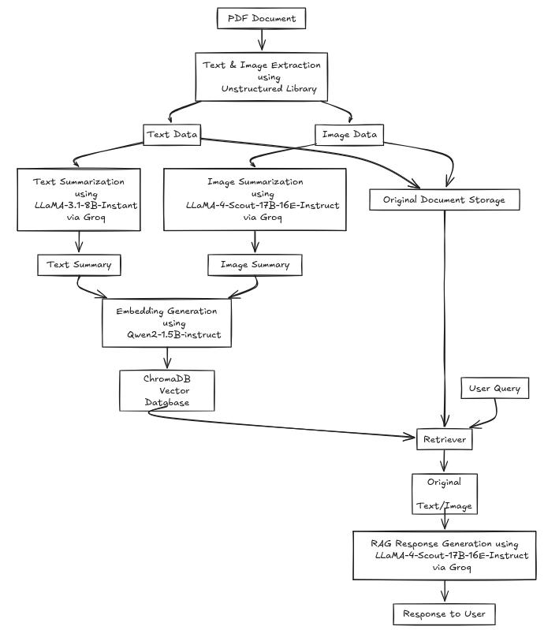

# Research Paper Assistant - A Multimodal RAG Pipeline

## Introduction

This repository implements a multimodal Retrieval-Augmented Generation (RAG) pipeline designed to process both text and image data from PDF documents and assist while reading research papers. Text and image data are extracted from PDFs using the "unstructured" library. This content is first summarized to reduce token usage during embedding and retrieval using LLaMA-3.1-8B-Instant for Text Summarization and LLaMA-4-Scout-17B-16E-Instruct for Image Summarization. Inference was performed using the Groq cloud. Groq's free tier provides significantly higher usage limits than the Hugging Face free tier. You can generate your free API key [here](https://console.groq.com/keys)

The generated summaries are then embedded using Qwen2-1.5B-instruct and stored in the ChromaDB vector database. The original full documents (text and image) are retained separately for constructing detailed responses during query handling. When a user submits a query, the system first retrieves relevant document chunks from ChromaDB based on semantic similarity. These document IDs are used to fetch the original text and image content. The retrieved information is structured into content blocks including system instructions, the user's question, text context, and relevant images. This formatted prompt is then sent to LLaMA-4-Scout-17B-16E-Instruct via Groq to generate a comprehensive response that incorporates both textual and visual information from the original paper.

## Flow Chart

## Acknowledgments

1. Umar Jamil's RAG Tutorial - [YouTube](https://www.youtube.com/watch?v=rhZgXNdhWDY)
2. Paulo's Advanced RAG Techniques - [GitHub Repository](https://github.com/pdichone/advanced-rag-techniques)
3. Alejandro's Multimodal RAG: Chat with PDFs - [YouTube](https://www.youtube.com/watch?v=uLrReyH5cu0)
